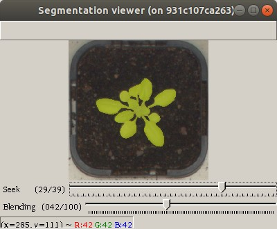
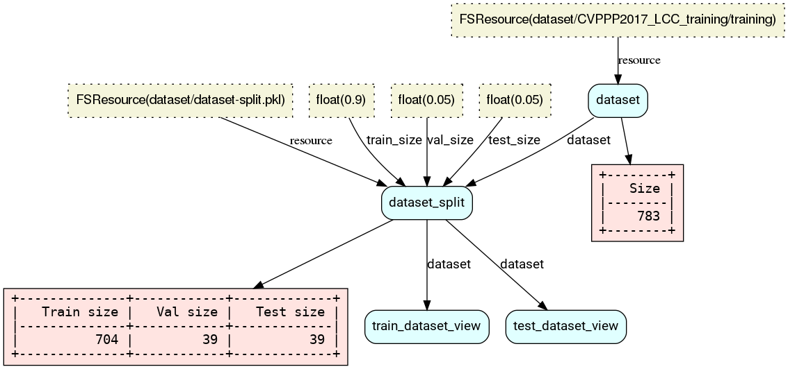
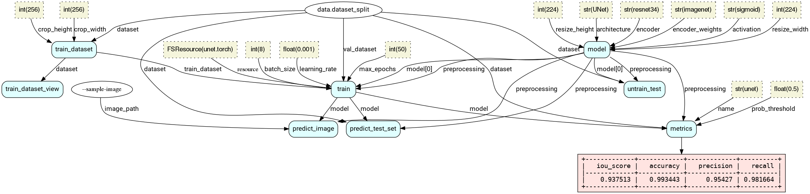
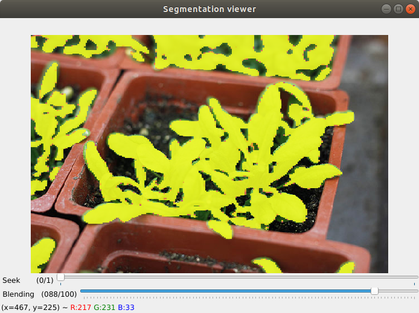

# Plant Segmentation Experiments

A simple project to demonstrate how to use [RFlow](https://github.com/otaviog/rflow) to create a semantic segmentation experiment. 
The goal is to segment leaves from the [LEAF SEGMENTATION AND COUNTING CHALLENGES](https://www.plant-phenotyping.org/CVPPP2017-challenge)
For simplicity, this sample does not count the leaves.
We evaluate 4 kinds of architectures: UNet (Resnet32), UNet (mobilenet), FPN (Resnet32) and Linknet (Resnet32), supplied by the [Segmentation Models Pytorch (SMP)](https://github.com/qubvel/segmentation_models.pytorch)



The workflows are coded on the `workflow.py` file. The `data` workflow for loading and splitting the image set:



* `dataset`: Load the dataset from the directory `dataset`.
* `dataset_split`: Split the dataset into train, validation and test sets.
* `train_dataset_view`: Opens a viewer to navigate in the train set of images and masks.
  - Ex.: `rflow data run train_dataset_view`
* `test_dataset_view`: Opens a viewer to navigate in the test set of images and masks.

The `unet`, `unet_mobilenet`, `fpn` and `linknet` workflows contain the experiments for each architecture. They have the same nodes, the bellow diagram is the one for Unet:



* `train_dataset`: Creates an augmented version of the training dataset.
* `train_dataset_view`: Opens a viewer to navigate in the train augmented set of images and masks.
* `model`: Creates the network model for training.
* `untrain_test`: Opens a viewer with predictions from the model without training. Useful to debug.
* `train`: Starts training. See the image for the used training parameters.
  - Ex.: `rflow unet run train`
* `predict_test_set`: Opens a viewer with predictions using the trained model with images from the test set.
  - Ex.: `rflow unet run predict_test_set`
* `predict_image`: Predict using the trained model the segmentation of an arbitrary image passed via the command line, parameter `--sample-image`.
* `metrics`: Evaluates the trained model with various metrics on the test set.

The `report` workflow:
* `all`: Prints a table with the metrics (node `metrics`) from all experiments. The result should be similar to the following:

|         | unet |unet_mobilenet| fpn  |linknet|
|---------|-----:|-------------:|-----:|------:|
|iou_score|0.9375|        0.9481|0.9410| 0.9348|
|accuracy |0.9934|        0.9947|0.9940| 0.9934|
|precision|0.9543|        0.9707|0.9666| 0.9703|
|recall   |0.9817|        0.9760|0.9727| 0.9624|


# Executing

Download the dataset LEAF COUNTING CHALLENGE (https://www.plant-phenotyping.org/CVPPP2017-challenge), and extract it on the [dataset directory](dataset/). 
The file structure should be as the following:

```shell
dataset
├── CVPPP2017_LCC_training
│   ├── LCC 2017 data description and further details.pdf
│   └── training
│       ├── A1
│       │   ├── A1.csv
│       │   ├── plant001_centers.png
│       │   ├── plant001_fg.png
│       │   ├── plant001_rgb.png
...
│       │   ├── plant161_centers.png
│       │   ├── plant161_fg.png
│       │   └── plant161_rgb.png
│       ├── A2
│       │   ├── A2.csv
│       │   ├── plant001_centers.png
│       │   ├── plant001_fg.png
│       │   ├── plant001_rgb.png
...
│       │   ├── plant039_centers.png
│       │   ├── plant039_fg.png
│       │   └── plant039_rgb.png
│       ├── A3
│       │   ├── A3.csv
│       │   ├── plant001_centers.png
│       │   ├── plant001_fg.png
│       │   ├── plant001_rgb.png
...
│       │   ├── plant027_centers.png
│       │   ├── plant027_fg.png
│       │   └── plant027_rgb.png
│       └── A4
│           ├── A4.csv
│           ├── plant0001_centers.png
│           ├── plant0001_fg.png
│           ├── plant0001_rgb.png
...
│           ├── plant0857_centers.png
│           ├── plant0857_fg.png
│           └── plant0857_rgb.png
...
```

## Virtual environment

Required/Tested system:

* Ubuntu>=18.04
* Python>=3.7

Create your virtual environment or conda environment, and install the requirements:

```shell
(env-name)$ pip install -r requirements.txt
(env-name)$ pip install opencv-python==4.4.0.46
(env-name)$ pip install module
```

To train the resnet:

```shell
$ rflow run fpn train
```

To predict with an arbitrary image:

```shell
$ rflow fpn run predict_image --sample-image dataset/resources/640px-Arabidopsis_Thaliana_planted_in_Laboratory.jpeg
```



If the `train` was not executed yet, it automatically will by rflow.

## Docker

```shell
$ docker run --gpus all\
    --volume=`pwd`/dataset:/workspace/plant-segmentation/dataset\
    --user=`id -u`:`id -g`\
    --env="DISPLAY"\
    --env NVIDIA_DRIVER_CAPABILITIES=all\
    --env XAUTHORITY\
    --volume="/etc/group:/etc/group:ro"\
    --volume="/etc/passwd:/etc/passwd:ro"\
    --volume="/etc/shadow:/etc/shadow:ro"\
    --volume="/etc/sudoers.d:/etc/sudoers.d:ro"\
    --volume="/tmp/.X11-unix:/tmp/.X11-unix:rw"\
    --volume=${HOME}:${HOME}\
    --ipc=host\
    -it otaviog/plant-segmentation /bin/bash	
(docker) $ rflow mobilenet run predict_test_set
```

Or use the rflow-docker, script. This is a wrapper that calls rflow from a docker container mapping the current folder to the docker.


```shell
$ ./rflow-docker fpn run predict_image --sample-image dataset/resources/640px-Arabidopsis_Thaliana_planted_in_Laboratory.jpeg
```
